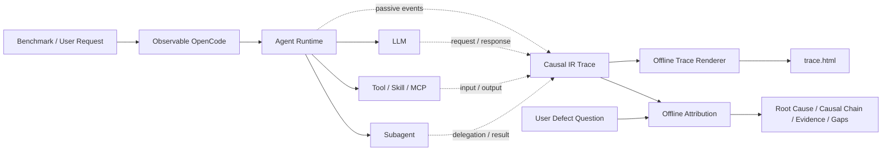

# Observable OpenCode

面向 AI Harness 评测、诊断和持续优化的可观测 OpenCode。该分支在保持
OpenCode Agent 原有执行行为的前提下，被动记录任务编排、上下文变换、LLM
请求、Tool/Skill/MCP、Subagent、代码变更、验证结果和最终回复之间的语义数据流，
并提供独立的离线因果归因模块。

> 本项目基于开源 [OpenCode](https://github.com/anomalyco/opencode) 改造，
> 不是 OpenCode 官方发行版，也不隶属于 OpenCode 团队。

## 核心能力

- **可评估**：可以用 benchmark case、评审事实和外部 evaluation 结果描述最终表现。
- **可观测**：每个 case 生成一份结构化 Trace；可用独立的离线 renderer 生成 `trace.html` 查看完整 Agent 流程和组件数据流。
- **可归因**：基于 Causal IR、重建的数据流和 LLM 判断执行后向语义污点分析。
- **可优化**：把根因、因果链、证据引用和语义缺口转化为 Harness 的下一轮优化输入。
- **行为隔离**：Trace 插装只被动记录；归因模块离线运行，不把分析结果反馈给正在执行的 Agent。



## 快速开始

下面以 OpenAI 兼容接口为例，给出从启动 Agent 到生成 Trace 的最短可执行路径。
`MODEL`、`APIKEY`、`URL` 是配置文件中的环境变量占位符，不是 Observable OpenCode
新增的模型协议。模型解析、Provider 选择和认证仍由 OpenCode 原生配置负责。

```bash
export MODEL="<provider-model-id>"
export URL="https://<openai-compatible-host>/v1"
export APIKEY="<api-key>"

export OPENCODE_CONFIG_CONTENT='{
  "model": "compatible/{env:MODEL}",
  "provider": {
    "compatible": {
      "npm": "@ai-sdk/openai-compatible",
      "name": "OpenAI Compatible",
      "options": {
        "baseURL": "{env:URL}",
        "apiKey": "{env:APIKEY}",
        "timeout": 720000,
        "chunkTimeout": 720000
      },
      "models": {
        "{env:MODEL}": {"name": "{env:MODEL}"}
      }
    }
  }
}'

export OPENCODE_DISABLE_MODELS_FETCH=1
export OPENCODE_CASE_TRACE=1
export OPENCODE_CASE_ID="benchmark-case-001"
export OPENCODE_CASE_TRACE_DIR="/data/evo-bench/traces"

opencode /data/repos/target-project
```

这里的 `MODEL` 是兼容接口直接接收的模型 ID，例如 `glm-5.1`，不要添加
`compatible/` 前缀。OpenCode 使用固定 Provider ID `compatible`，最终选择的完整模型标识为
`compatible/$MODEL`。`URL` 必须填写服务实际要求的 Base URL；如果接口路径是
`/v1/chat/completions`，通常应以 `/v1` 结尾。

在 TUI 中完成提问后正常退出。终端会打印本次 root session 的 `trace.json` 和
`partial/latest.json` 路径。HTML 仅由独立 renderer 在离线时生成。HTTP benchmark 使用方式见
[启动 HTTP Server 并记录 Trace](#启动-http-server-并记录-trace)，离线分析方式见
[使用离线归因 CLI](#使用离线归因-cli)。

## 获取 Release 可执行文件

GitHub Actions 会发布 Linux、macOS 和 Windows 的独立可执行文件，不需要在目标机器上
执行 `bun install`。从 [Releases](https://github.com/zyscoder/observable-opencode/releases)
选择对应资产：

| 系统 | Runtime 资产 | 离线 Renderer 资产 |
| --- | --- | --- |
| Linux x86_64 | `opencode-observable-linux-x64` | `observable-trace-linux-x64` |
| 旧 x86_64 CPU（无 AVX2） | `opencode-observable-linux-x64-baseline` | `observable-trace-linux-x64-baseline` |
| Alpine/musl x86_64 | `opencode-observable-linux-x64-musl` | `observable-trace-linux-x64-musl` |
| Alpine/musl 旧 x86_64 CPU（无 AVX2） | `opencode-observable-linux-x64-baseline-musl` | `observable-trace-linux-x64-baseline-musl` |
| Linux arm64 | `opencode-observable-linux-arm64` | `observable-trace-linux-arm64` |
| Alpine/musl Linux arm64 | `opencode-observable-linux-arm64-musl` | `observable-trace-linux-arm64-musl` |
| macOS Apple Silicon | `opencode-observable-darwin-arm64` | `observable-trace-darwin-arm64` |
| macOS Intel | `opencode-observable-darwin-x64` | `observable-trace-darwin-x64` |
| macOS Intel（无 AVX2） | `opencode-observable-darwin-x64-baseline` | `observable-trace-darwin-x64-baseline` |
| Windows arm64 | `opencode-observable-windows-arm64.exe` | `observable-trace-windows-arm64.exe` |
| Windows x64 | `opencode-observable-windows-x64.exe` | `observable-trace-windows-x64.exe` |
| Windows x64（无 AVX2） | `opencode-observable-windows-x64-baseline.exe` | `observable-trace-windows-x64-baseline.exe` |

以 Linux x86_64 为例：

```bash
RELEASE_TAG="<Releases 页面中的版本，例如 v1.2.3-observable.1>"
ASSET="opencode-observable-linux-x64"
TRACE_ASSET="observable-trace-linux-x64"
BASE_URL="https://github.com/zyscoder/observable-opencode/releases/download/${RELEASE_TAG}"

curl -fL -o "$ASSET" "$BASE_URL/$ASSET"
curl -fL -o "$TRACE_ASSET" "$BASE_URL/$TRACE_ASSET"
curl -fL -o SHA256SUMS "$BASE_URL/SHA256SUMS"
grep "  $ASSET$" SHA256SUMS | sha256sum --check
grep "  $TRACE_ASSET$" SHA256SUMS | sha256sum --check
chmod +x "$ASSET"
chmod +x "$TRACE_ASSET"
./"$ASSET" --version
```

替换现有 `opencode` 前建议先备份：

```bash
CURRENT_OPENCODE="$(command -v opencode || true)"
if [ -n "$CURRENT_OPENCODE" ]; then
  cp "$CURRENT_OPENCODE" "${CURRENT_OPENCODE}.backup.$(date +%Y%m%d%H%M%S)"
fi
sudo install -m 755 opencode-observable-linux-x64 /usr/local/bin/opencode
opencode --version
```

macOS 校验可执行：

```bash
RELEASE_TAG="<Releases 页面中的版本，例如 v1.2.3-observable.1>"
ASSET="opencode-observable-darwin-arm64"
TRACE_ASSET="observable-trace-darwin-arm64"
BASE_URL="https://github.com/zyscoder/observable-opencode/releases/download/${RELEASE_TAG}"

curl -fL -o "$ASSET" "$BASE_URL/$ASSET"
curl -fL -o "$TRACE_ASSET" "$BASE_URL/$TRACE_ASSET"
curl -fL -o SHA256SUMS "$BASE_URL/SHA256SUMS"
grep "  $ASSET$" SHA256SUMS | shasum -a 256 --check
grep "  $TRACE_ASSET$" SHA256SUMS | shasum -a 256 --check
chmod +x "$ASSET"
chmod +x "$TRACE_ASSET"
./"$ASSET" --version
```

如果 macOS 阻止运行从浏览器下载的二进制，可在确认校验和及来源后移除隔离属性：

```bash
xattr -d com.apple.quarantine opencode-observable-darwin-arm64
```

## 配置模型与 Provider

Observable OpenCode 不引入专属运行时 Provider，也不读取某个供应商专用 API Key。
模型、认证和 Provider 均由 **OpenCode 原生配置链** 决定；本项目只被动记录已经发生的
执行。请以 OpenCode 实际加载的配置和原生 CLI、请求级覆盖为权威，不应依赖本文推断
配置合并或优先级。

OpenCode 会依次加载并合并全局配置目录（通常为 `~/.config/opencode/`）中的
`config.json`、`opencode.json` 和 `opencode.jsonc`，并发现项目中的 `opencode.json`、
`opencode.jsonc` 以及 `.opencode/opencode.json`、`.opencode/opencode.jsonc`。也可使用原生入口
`OPENCODE_CONFIG`、`OPENCODE_CONFIG_DIR`、`OPENCODE_CONFIG_CONTENT`，或原生 CLI 和
请求参数覆盖。不同版本及配置来源会按 OpenCode 的原生合并规则处理。

下面是一个兼容 OpenAI 风格 API 的通用模板。可放在项目 `opencode.json` 或你选择的
原生配置文件中：

```json
{
  "$schema": "https://opencode.ai/config.json",
  "model": "compatible/{env:MODEL}",
  "provider": {
    "compatible": {
      "npm": "@ai-sdk/openai-compatible",
      "name": "OpenAI Compatible",
      "options": {
        "baseURL": "{env:URL}",
        "apiKey": "{env:APIKEY}",
        "timeout": 720000,
        "chunkTimeout": 720000
      },
      "models": {
        "{env:MODEL}": { "name": "{env:MODEL}" }
      }
    }
  }
}
```

其中 `MODEL` 是 Provider 接口直接接收的原始模型 ID，不包含 `compatible/` 前缀；
`APIKEY` 和 `URL` 分别提供该兼容服务的认证和 Base URL。它们只是此模板选用的环境变量
占位符，可以替换为企业自己的变量名，并不是 Observable OpenCode 的特殊运行时环境变量。
若使用 OpenCode 内置 Provider，应优先使用该 Provider 的原生认证和配置方式。

使用任意 OpenAI 兼容接口时，只需要替换下面三个环境变量。URL 必须以供应商或企业网关的
实际文档为准：

```bash
export MODEL="<provider-model-id>"
export URL="https://<openai-compatible-host>/v1"
export APIKEY="<api-key>"
```

在启动 OpenCode 前，建议先直接验证兼容接口。`URL` 是 Base URL，下面的命令会在其后
追加 `/chat/completions`；因此常见服务应把 `URL` 配成以 `/v1` 结尾，而不是把完整
`/v1/chat/completions` 写入 `URL`：

```bash
curl -sS --fail-with-body \
  --connect-timeout 10 \
  --max-time 120 \
  -H "Authorization: Bearer $APIKEY" \
  -H "Content-Type: application/json" \
  "${URL%/}/chat/completions" \
  --data "$(jq -nc --arg model "$MODEL" '{
    model: $model,
    messages: [{role: "user", content: "只回答数字：1+2等于多少？"}],
    stream: false
  }')" | jq .
```

应同时确认 HTTP 请求成功、响应中包含 assistant 消息、返回模型与 `$MODEL` 一致或符合网关
映射。只得到 HTTP 200 并不等于模型配置正确；若响应不是预期答案，应先核对 `$URL` 是否缺少
`/v1`、模型 ID 是否受网关支持，以及返回体中的错误或路由信息。

企业网络无法稳定访问 `models.dev` 时，可关闭启动阶段的远程模型目录刷新。程序会使用
编译进可执行文件的模型快照：

```bash
export OPENCODE_DISABLE_MODELS_FETCH=1
```

也可以按 OpenCode 原生方式限制刷新超时或指向企业内部镜像：

```bash
export OPENCODE_MODELS_FETCH_TIMEOUT_MS=2500
# export OPENCODE_MODELS_URL="https://models.example.internal"
```

### 运行时环境变量

| 环境变量 | 是否必需 | 作用 |
| --- | --- | --- |
| `OPENCODE_CONFIG` | 否 | 指向额外的 OpenCode 原生配置文件。 |
| `OPENCODE_CONFIG_DIR` | 否 | 指定 OpenCode 原生配置目录。 |
| `OPENCODE_CONFIG_CONTENT` | 否 | 直接注入 OpenCode 原生 JSON 配置，适合 CI 或 benchmark。 |
| `MODEL` | 取决于配置 | 本文兼容接口模板使用的原始模型 ID，不包含 `compatible/` 前缀。 |
| `APIKEY` | 取决于配置 | 本文模板使用的 Provider API Key。请通过 Secret 注入，不要写入仓库。 |
| `URL` | 取决于配置 | 本文模板使用的兼容 API Base URL。 |
| `OPENCODE_DISABLE_MODELS_FETCH` | 推荐 | 设为 `1` 时跳过启动阶段的 `models.dev` 请求，使用内置模型快照。 |
| `OPENCODE_MODELS_FETCH_TIMEOUT_MS` | 否 | 远程模型目录请求超时，单位为毫秒。 |
| `OPENCODE_MODELS_URL` | 否 | 将远程模型目录切换到企业镜像。 |
| `OPENCODE_CASE_TRACE` | 是 | 设为 `1` 启用语义 Trace。 |
| `OPENCODE_CASE_TRACE_DIR` | 推荐 | Trace 根目录；未设置时使用 OpenCode 数据目录下的 `case-traces/`。 |
| `OPENCODE_CASE_ID` | 推荐 | case 的稳定标识，建议使用 benchmark case ID。 |
| `OPENCODE_CASE_TRACE_QUIET` | 否 | 设为 `1` 隐藏退出时的 Trace 路径提示，不影响落盘。 |
| `OPENCODE_TUI_SHUTDOWN_TIMEOUT_MS` | 否 | TUI worker 完成资源清理后，等待独立 journal-close RPC 的最大时长（毫秒）；启用 Trace 时默认 `3600000`，未启用时默认 `5000`。worker 资源清理另有固定 `5000` 毫秒上限；该变量不限制 materializer、Agent 或 LLM 的执行时长。 |
| `OPENCODE_SERVER_PASSWORD` | HTTP 推荐 | 为 `opencode serve` 启用 Basic Auth，用户名固定为 `opencode`。 |

高级变量 `OPENCODE_CASE_TRACE_MAX_FIELD_LENGTH` 控制结构化记录中内联字段的预览长度，
默认值为 `2048`。大文本会写入 `artifacts/` 并由 HTML 按需展示。通常应保持默认值；将它
提高到数十万会显著放大序列化、内存和收尾开销，复杂 case 甚至可能延迟信号处理。

Trace recorder 的默认内存边界是 512 个 hot Causal IR nodes、1,024 个 hot edges、每类最多
256 个 recent refs，以及 2,048 字符的内联语义预览；已完成的 active lifecycle record 会立即
驱逐。冷数据从 segment-local SQLite 查询，增大这些边界不是保持语义完整性的前提。验收上限是
标准 10,000-record payload 在 warm-up 后的 observer-owned RSS 增长不超过 128 MiB，以及 1 GiB
journal 的离线 materializer peak RSS 不超过 256 MiB。这些是 Trace 自身的内存边界，不会改变
OpenCode 的模型 context window、compaction 或 Agent 行为。

### 目标仓库的 `.opencode` 扩展依赖

Release 可执行文件包含 Observable OpenCode 本身，但无法预先打包任意目标仓库中
`.opencode/` 插件、Tool 或 Skill 所依赖的 npm/workspace 包。如果启动时报错类似：

```text
Cannot find module '@opencode-ai/plugin' from '/path/to/project/.opencode/...'
```

应按目标仓库自己的开发说明安装或提供这些依赖。若该扩展与本次 benchmark 无关，也可以
只在 benchmark 副本中停用对应扩展。不要把这类错误误判为 Release 二进制缺少自身依赖，
也不要为了绕过错误而修改生产仓库。

## 交互式 TUI 并记录 Trace

交互式 TUI 是一等入口。先通过上述 OpenCode 原生配置选择 Provider 和模型，再启动
目标项目：

```bash
export MODEL="<provider-model-id>"
export URL="https://<openai-compatible-host>/v1"
export APIKEY="<api-key>"

export OPENCODE_DISABLE_MODELS_FETCH=1
export OPENCODE_CASE_TRACE=1
export OPENCODE_CASE_TRACE_DIR="/data/evo-bench/traces"
# 可选：为一次 benchmark case 指定稳定名称
export OPENCODE_CASE_ID="benchmark-case-001"

opencode /data/repos/target-project
```

同一 root session 的多轮交互写入同一份 Trace。输入 `/new` 会独立完成旧 root，并为
新 root 创建另一份 Trace；Subagent 的事件归入其父 root。正常退出、root session 删除
或收到可捕获的 `SIGINT`、`SIGTERM`、`SIGHUP` 时，程序会先持久化已有数据，再对每个
已完成 root 向 `stderr` 输出保存位置：

```text
[observable-opencode] Session trace saved
  session: ses_...
  case: benchmark-case-001
  status: completed
  directory: /data/evo-bench/traces/benchmark-case-001--ses_...--a1b2c3d4
  json: /data/evo-bench/traces/benchmark-case-001--ses_...--a1b2c3d4/trace.json
  partial: /data/evo-bench/traces/benchmark-case-001--ses_...--a1b2c3d4/partial/latest.json
```

在 TUI 中，正常退出、`Ctrl-C`/`SIGINT` 和 `SIGTERM` 都走同一条 parent/worker 生命周期：
worker 先释放 Session、Tool、MCP 和内部 Server，只向当前 segment journal 追加轻量
`case.runtime_closed` terminal record；parent 随后终止 worker，并在独立进程中运行 materializer，
最后发布 root `trace.json`。完整 Causal IR、provenance 和 legacy projection 不在 Agent worker 的
退出堆内构造。

parent 首先等待 worker 释放 Session、Tool、MCP 和内部 Server；这一步有独立且不可配置的
`5000` 毫秒清理上限。清理成功后才调用 journal-close RPC。`OPENCODE_TUI_SHUTDOWN_TIMEOUT_MS`
只限制这次 journal close，启用 Trace 时默认 `3600000`，未启用时默认 `5000`。它不是 LLM、
Tool 或整个 case 的执行超时。journal close 完成后 parent 终止 worker，再启动独立 materializer；
materializer 不受该变量限制，TUI 会等待其子进程完成，但 materializer 失败仍只降低 observability。
确需覆盖 journal-close 上限时可使用：

```bash
# 允许复杂长 session 在 Ctrl-C 后最多用两小时完成 journal close
export OPENCODE_TUI_SHUTDOWN_TIMEOUT_MS=7200000
```

worker close 或 materializer 失败只降低 observability：不会重试 Agent 操作，不会改变消息、
文件、session rows 或原始退出码。失败时 immutable segment 仍是权威证据，可使用
`observable-trace finalize <logical-case-dir>` 重试；成功后，终端才会打印 logical directory、
root JSON 和 partial 路径。`OPENCODE_CASE_TRACE_QUIET=1` 只隐藏这份 Trace receipt。

使用 `opencode -s <session-id> /path/to/project` 继续同一 session 时，runtime 会定位已有 logical
case directory，在 `segments/` 下创建新的 process-lifetime segment，并用 `continuation_of` 和
统一 Trace 中的 `run.continuation` 语义连接前一 run。已有 journal、artifact、index 和
`segment.json` 不会被打开写入、截断或删除。

`SIGKILL` 和 OOM 无法执行任何用户态 cleanup，因此不会立即完成 Trace，也不应期待当前 run
马上出现新的 `trace.json` 或 `partial/latest.json`。被杀前已完整 append 的 JSONL 行和 artifact
仍是 durable evidence；之后显式 finalization 或下一次同 session continuation 会把无 terminal
record 的前一 segment 标记为 `interrupted_unfinalized`，并从 valid journal prefix 恢复统一 Trace。

## 启动 HTTP Server 并记录 Trace

Benchmark 可以通过 `opencode session <-> HTTP server <-> request` 执行，以贴近
Harness 的实际交互行为。HTTP 路径与 TUI 使用同一套原生配置；请求中不需要重复指定
模型。

```bash
export OPENCODE_SERVER_PASSWORD="<server-password>"
export OPENCODE_CASE_TRACE=1
export OPENCODE_CASE_TRACE_DIR="/data/evo-bench/traces"
export OPENCODE_CASE_ID="benchmark-case-001"

opencode serve --hostname 127.0.0.1 --port 4096
```

在另一个终端创建 session 并发送消息：

```bash
PROJECT_DIR="/data/repos/target-project"
AUTH="$(printf 'opencode:%s' "$OPENCODE_SERVER_PASSWORD" | base64)"

SESSION_JSON="$(curl -fsS -X POST http://127.0.0.1:4096/session \
  -H "Authorization: Basic $AUTH" \
  -H "x-opencode-directory: $PROJECT_DIR" \
  -H 'content-type: application/json' \
  --data '{}')"
SESSION_ID="$(printf '%s' "$SESSION_JSON" | jq -er '.id')"

curl -fsS --max-time 3600 -X POST "http://127.0.0.1:4096/session/$SESSION_ID/message" \
  -H "Authorization: Basic $AUTH" \
  -H "x-opencode-directory: $PROJECT_DIR" \
  -H 'content-type: application/json' \
  --data '{
    "parts": [{"type": "text", "text": "分析并修复当前项目中的测试失败。"}]
  }'
```

消息接口会同步等待本轮 Agent 执行完成。复杂 case 应同时为 `curl`、Benchmark Harness、
反向代理和负载均衡器设置足够长且一致的超时，避免客户端提前断开后将正常执行误记为
取消或失败。

只有特定 case 需要与项目或全局配置不同的模型时，才使用 OpenCode 原生请求级 model
覆盖。完成一个 HTTP session 时建议显式删除它，以立刻完成该 root 的 Trace；否则服务
关闭时会统一收尾：

```bash
curl -fsS -X DELETE "http://127.0.0.1:4096/session/$SESSION_ID" \
  -H "Authorization: Basic $AUTH" \
  -H "x-opencode-directory: $PROJECT_DIR"
```

HTTP server 与 TUI 使用同一 logical-root/immutable-segment 格式。删除 root session 或正常、
可捕获信号关闭 server 会自动完成可达 Trace；进程被 `SIGKILL` 时同样只能在之后从 durable
segment evidence 恢复。自动发布失败不会改变 HTTP response 或 session 数据，可在 server 外部
用同一个 `observable-trace finalize <logical-case-dir>` 命令重试。

## Trace 目录

一个 root session 对应一个 logical Trace directory；同一 session 的每个 process lifetime
写入一个新的 segment。一个进程仍可因 `/new`、多个 HTTP root session 或 process-level
事件生成多个 logical roots。以 `benchmark-case-001` 为例：

```text
/data/evo-bench/traces/
├── benchmark-case-001/                               # first logical root
├── benchmark-case-001--<session>--<digest>/          # another root session
└── benchmark-case-001--process--<digest>/            # process-level root
```

新的 segmented logical root 布局如下：

```text
<logical-case-dir>/
├── session.json                       # atomic ordered segment manifest + generation
├── segments/
│   ├── <segment-id-1>/
│   │   ├── segment.json               # immutable process-lifetime identity
│   │   ├── records.jsonl              # authoritative append-only Causal IR journal
│   │   ├── events.jsonl
│   │   ├── raw-events.jsonl
│   │   ├── index.sqlite               # private observer index
│   │   └── artifacts/                 # immutable large semantic payloads
│   └── <segment-id-2>/
│       └── ...
├── trace.json                         # generation-switched unified derived output
├── provenance-trace.json              # derived compatibility projection
├── legacy-trace.json                  # derived compatibility projection
├── manifest.json                      # derived unified manifest
├── partial/latest.json                # derived terminal/recovery view
└── artifacts/                         # compatibility links/copies only
```

`records.jsonl` 与 segment artifacts 是 durable authority。`session.json` 使用原子替换记录
segment 顺序、session/run identity、continuation、状态和当前 generation。root `trace.json`
及相关文件只是一个 generation 的统一派生输出，可以在不改变任何 prior evidence 的情况下
重建和替换。新的 segmented run 不会在 root 创建可变 `records.jsonl` alias。

现有 flat root 仍作为 read-only legacy segment zero 支持：原有 root `records.jsonl`、
`index.sqlite` 和 artifacts 保持原位且不被改写；renderer/materializer 可以读取它们并生成派生
视图，但 runtime 不会把后续 run 追加到旧 flat journal。已有 `trace.html` 也不会被 runtime
删除或更新，resume 或重新 finalization 后必须显式重新 render。

### 长任务恢复操作

长 session 不依赖进程内完整快照。运行时持续追加当前 segment journal，退出时只关闭
segment；统一 `trace.json` 由独立 materializer 从所有 segment 重建。推荐按以下顺序处理：

1. 正常退出、`Ctrl-C` 或 `SIGTERM` 后，先查看终端打印的 logical case directory 和
   `trace.json` 路径。
2. 如果有 `session.json` 和 `segments/*/records.jsonl`，但没有当前 generation 的
   `trace.json`，执行 `observable-trace finalize <logical-case-dir>`。
3. 如果进程因 OOM 或 `SIGKILL` 消失，使用原命令和 `opencode -s <session-id>
   <project-dir>` 恢复 session。新进程会创建新 segment，旧 segment 保持只读并标记为
   `interrupted_unfinalized`。
4. 完成后再次执行 `finalize`，再用 `render` 生成供人工查看的 HTML。

可用下面的命令快速检查 logical Trace 是否可恢复：

```bash
CASE_DIR="/data/evo-bench/traces/benchmark-case-001"

jq '{logical_case_id, generation, segments}' "$CASE_DIR/session.json"
find "$CASE_DIR/segments" -maxdepth 2 \
  -type f \( -name segment.json -o -name records.jsonl \) -print
./observable-trace-linux-x64 finalize "$CASE_DIR"
jq '{case_id: .manifest.case_id, status: .manifest.status, records: (.records | length)}' \
  "$CASE_DIR/trace.json"
```

`session.json` 与 segment journal 是恢复依据，不要手工合并、截断或移动其中的文件。若需要
归档，应复制整个 logical case directory，确保 manifest、所有 segment 和 artifacts 一起保留。

## 离线渲染 Trace

运行时不会生成 HTML。下载与 OpenCode runtime 相同平台后缀的
`observable-trace-<platform>`。自动 materialization 失败、SIGKILL recovery 或需要显式刷新
root generation 时，先执行可重复的 manual finalization：

```bash
./observable-trace-linux-x64 finalize /data/evo-bench/traces/benchmark-case-001
```

该命令从所有 ordered segments 的 valid journal prefix 原子重建 root derived outputs；失败可
再次运行，且不会修改 segment evidence。随后生成 HTML：

```bash
./observable-trace-linux-x64 render /data/evo-bench/traces/benchmark-case-001
```

默认输出是 `<case-dir>/trace.html`；也可用 `--output <path>` 写到报告目录。renderer 接受
logical case directory、root `session.json`、root `trace.json`，以及 read-only legacy flat
directory/file。若 root derived output 缺失或 generation 已过期，renderer 会在临时目录进行
read-only materialization，再把完整或 incomplete recovery 状态写入 HTML，不会更新 source
root。包含 `interrupted_unfinalized` segment 的视图会明确标为 incomplete，不能当作成功完成的
case。

生成的 HTML 只用于人工查看主 Agent、Subagent、任务编排、上下文压缩、message 多层转换、
LLM、Tool/Skill/MCP、文件变更、验证和最终回复之间的数据流。归因输入只能是 logical root
`trace.json` 或 logical case directory；不能使用某个 physical segment、segment-local output、
`legacy-trace.json` 或 `trace.html`。以 directory 为输入的流程必须先 finalization 当前
`session.json.generation`，再消费统一 root Trace。

## 使用离线归因 CLI

归因模块目前随源码仓库发布，并未安装为系统级命令。它不要求当前目录位于
`observable-opencode`；只需要把仓库中的 Python 包绝对路径加入 `PYTHONPATH`。
下面的 DeepSeek/Anthropic 兼容配置仅用于可选的离线归因 Judge，和 OpenCode 运行时的
Provider、模型选择及认证完全无关。

```bash
export OBSERVABLE_OPENCODE_HOME="/opt/observable-opencode"
export ATTRIBUTION_VENV="$HOME/.venvs/observable-opencode-attribution"
python3 -m venv "$ATTRIBUTION_VENV"
source "$ATTRIBUTION_VENV/bin/activate"
python -m pip install --upgrade pip anthropic

export ANTHROPIC_API_KEY="<your-deepseek-api-key>"
export ANTHROPIC_BASE_URL="https://api.deepseek.com/anthropic"
export CLAUDE_MODEL="deepseek-v4-flash"
export CLAUDE_TIMEOUT_SECONDS=3600

PYTHONPATH="$OBSERVABLE_OPENCODE_HOME/tools/trace_attribution" \
python -m trace_attribution \
  --engine recursive-agentic \
  --fusion-mode retrieval-global \
  --trace /data/evo-bench/traces/benchmark-case-001/trace.json \
  --question "为什么本次修改编译失败？" \
  --out /data/evo-bench/attribution/benchmark-case-001.json \
  --judge-timeout-sec 3600 \
  --judge-max-tokens 16000
```

渲染和归因是两个独立的离线步骤：使用 `observable-trace render <case-dir>` 查看 HTML；
使用上面的源码 checkout 命令，以 `--engine recursive-agentic --trace <case-dir>/trace.json`
和 `--question "..." --out <report>.json` 执行归因。即使已经渲染过 HTML，也必须把
`trace.json` 而不是 `trace.html` 传给归因 CLI。

归因 Judge 通过 Anthropic SDK 调用 Anthropic 兼容接口。它和运行 Observable OpenCode 的
模型相互独立，因此可以用一个模型执行 case、另一个模型离线归因。环境变量含义如下：

| 环境变量 | 是否必需 | 作用 |
| --- | --- | --- |
| `OBSERVABLE_OPENCODE_HOME` | 推荐 | 源码仓绝对路径；用于构造 `PYTHONPATH`，不要求 `cd` 到仓库。 |
| `ATTRIBUTION_VENV` | 否 | 本文示例使用的 Python 虚拟环境路径，可换成已有环境。 |
| `PYTHONPATH` | 是 | 至少包含 `$OBSERVABLE_OPENCODE_HOME/tools/trace_attribution`。 |
| `ANTHROPIC_API_KEY` | LLM Judge 必需 | Anthropic 或 Anthropic 兼容服务的 API Key。 |
| `ANTHROPIC_BASE_URL` | 兼容服务必需 | 例如 DeepSeek 的 `https://api.deepseek.com/anthropic`。 |
| `CLAUDE_MODEL` | 推荐 | 归因 Judge 使用的模型 ID。 |
| `CLAUDE_TIMEOUT_SECONDS` | 否 | 每次 Judge/repair 请求超时，默认 `3600` 秒。 |

推荐先使用 CLI 默认候选预算：`max_nodes=48`、`max_frontier_items=96`、
`max_hypotheses=24`、`max_investigation_rounds=12`、`max_judge_requests=128`。只有在报告
明确显示预算耗尽时再扩大相应参数。`--judge-max-tokens` 默认是 `8192`；推理模型输出
较长 JSON 时可像上例提高，但需确认服务端支持该上限。

`--question` 用于描述用户真正想定位的缺陷，例如：

- `为什么问题回答错误？`
- `为什么编译失败？`
- `为什么最终回复没有给出正确的配置项？`
- `为什么 Agent 计划调用 Subagent，但实际没有执行？`

它与兼容参数 `--objective` 互斥。推荐使用 `recursive-agentic` 引擎执行
“候选检索、递归后向污点、多假设回溯、独立根因确认”的融合流程。

归因 JSON 在普通报告之外增加：

- `analysis_question`：规范化问题、稳定问题 ID 和 Trace 绑定；
- `conclusion`：已确认根因，或明确的证据不足结论；
- `causal_chain`：从表现缺陷回溯到引入节点的语义路径；
- `supporting_evidence_refs`：可审计的 Trace 证据引用；
- `rejected_hypotheses`：被排除的候选及原因；
- `confidence`：已确认根因的置信度；
- `unresolved_gaps`：Trace 缺失或仍无法判定的语义信息。
- `defect_evolution`：从行为契约、上下文传递、缺陷首次引入、动作物化、迟到补偿到用户观察的逐步语义演化。它同时保存机器可审计的节点、状态和证据，以及面向使用者的“谁做了什么、当时知道什么、为什么有问题、怎样影响下一步”。
- `defect_subject`、`expected_sequence`、`actual_sequence`、`first_deviation`：明确命名本次追踪的具体偏差、比较的动作顺序和首次偏离位置，避免使用“比较期望顺序”“缺陷出现”等没有对象的抽象表述。

对于已确认根因，模块会先根据 Causal IR、递归路径和数据流边确定性重建
`defect_evolution`，再调用同一个离线 Judge 对这些不可变步骤生成中文解释。LLM 只能补充说明，
不能增加、删除、合并或重排节点，也不能修改缺陷状态和证据引用；若输出违反约束，会自动回退
到确定性解释。该过程只读取 Trace，不改变 Agent、OpenCode session 或 Trace 采集行为。

如果没有足够证据，模块会返回
`no_confirmed_root_cause / evidence_insufficient`，不会为了给出答案而虚构根因。
对于已知缺陷节点，可重复传入 `--start-ref decision:dec_107`、`--start-ref node:<id>` 等
Trace 引用收窄起点；若不知道节点，保持自动候选检索即可。被中断且没有最终回复的 Trace
可能只能确认“中断触发了失败状态”，这不等于中断就是任务质量缺陷的根因，归因模块会在
证据不足时保留 `inconclusive` 结论。

### CLI 产物

若 `--out` 为 `/data/evo-bench/attribution/case-001.json`，归因过程中会同时维护结果、
message lineage、Judge cache 和递归 checkpoint。发生网络中断或进程重启后，可使用相同
参数继续分析，避免重复消耗已经完成的 Judge 请求。分析正常结束后，CLI 会依次打印
`--out` 指定的 JSON 路径和面向人工阅读的 Markdown 解释路径。

以上述 `--out` 为例，默认会得到：

```text
/data/evo-bench/attribution/
├── case-001.json                       # 最终结构化归因报告
├── case-001.explanation.md             # 完整缺陷描述和逐节点产生过程
├── case-001.message-lineage.json       # 离线重建的消息、上下文和数据流
├── case-001.judge-cache.jsonl          # 已完成的 LLM Judge 判断缓存
└── case-001.checkpoint/                # 递归分析断点，用于中断续跑
    ├── question-premise.json           # 用户问题前提判断及物理请求预留
    ├── manifest.json                   # Trace、问题、模型、预算等兼容性绑定
    ├── frontier.jsonl                  # 待分析/已分析节点
    ├── hypotheses.jsonl                # 多假设状态
    ├── investigation-actions.jsonl     # Judge、确认、预算和 Provider 生命周期
    ├── commit.json                     # 三类 journal 的一致提交点
    └── output-commit.json              # JSON 与 lineage 的原子发布状态
```

`--question` 首先经过独立的 premise gate，判断 Trace 是否支持“用户描述的偏差确实发生”。该结果
会在首次 Provider 请求前以 `inflight` 预留写入 `question-premise.json`，成功后原子替换为完整
assessment。这样，中断恢复不会重复调用 Provider，也不会把一次未可靠落盘的响应伪装成已完成
判断。premise、递归归因和缺陷解释共同受 `--max-judge-requests` 的物理请求上限约束；报告中的
`metadata.shared_judge_request_budget` 会分别列出三阶段的使用量。

归因被 `Ctrl-C`、`SIGTERM`、网络超时或进程重启打断时，应使用**完全相同的命令**重跑，包括
Trace、问题、模型、endpoint、预算、输出路径和 checkpoint 路径。CLI 会从已 fsync 的提交点恢复，
不会重放已完成 Judge 请求。若改变问题、模型、预算或 Trace，应使用新的 `--out`、
`--checkpoint-dir` 和 `--judge-cache`；不要删除旧 checkpoint 后覆盖原报告，以便保留审计链。

旧的未完成 checkpoint 如果没有无损保存 premise，会明确拒绝恢复，而不是重新询问模型并改变
因果输入。此时请保留旧目录用于审计，并使用新的输出与 checkpoint 路径重新分析。

`trace.html` 只用于人工查看 Agent 的原始执行流程，不承载归因结论。归因结果中的 Trace 引用
可以回到同一 case 的 `trace.html` 或 `trace.json` 核验，但不要把 HTML 当作归因输入。

直接阅读完整的缺陷产生过程：

```bash
cat /data/evo-bench/attribution/case-001.explanation.md
```

Markdown 默认采用工程复盘式表达：先明确本次追踪的偏差、期望动作顺序、实际动作顺序和首次
偏离，再按数据流逐步说明每个参与者做了什么、当时掌握了什么信息、为何引入或没有引入偏差、
结果怎样影响下一步。`tool.result`、节点 ID、`absent/present/propagated` 等内部字段只出现在文末
“技术证据附录”，用于开发者审计，不要求普通使用者理解。

本次升级不改变归因 CLI、Python API 或环境变量的使用方式。成功分析后仍然同时得到结构化
JSON 和 Markdown 报告；变化仅包括 `defect_evolution/v2` 新增偏差对象、期望/实际动作序列、
首次偏离和人类可读步骤字段，以及 Markdown 增加工程复盘正文和技术证据附录。对已经存在的
`trace.json`，使用原命令重新执行归因即可生成新版报告，不需要重新运行 Agent 或重新采集 Trace。

#### 查看分析结果

先指定报告路径：

```bash
REPORT=/data/evo-bench/attribution/case-001.json
```

查看面向用户的核心结论：

```bash
jq '{
  analysis_question,
  analysis_outcome,
  conclusion,
  confidence,
  defect_evolution,
  causal_chain,
  supporting_evidence_refs,
  rejected_hypotheses,
  unresolved_gaps
}' "$REPORT"
```

其中 `analysis_outcome` 表示整体判定状态：

- `root_found`：至少一个缺陷分支已经找到并确认根因；
- `partial_root_found`：部分缺陷分支已确认根因，其他分支仍未收敛；
- `no_defect`：现有证据没有确认用户所描述的缺陷；
- `inconclusive`：Trace、Judge 或搜索证据不足，无法可靠确认。

查看已确认根因及其置信度、理由和证据：

```bash
jq '{
  outcome: .analysis_outcome,
  conclusion,
  roots: .confirmed_roots,
  confidence
}' "$REPORT"
```

查看完整后向因果链：

```bash
jq '.causal_chain' "$REPORT"
```

查看各缺陷分支的节点判断、遍历路径和终止原因：

```bash
jq '.defect_branches' "$REPORT" | less
```

查看哪些 Trace 语义缺失或仍阻碍归因：

```bash
jq '{
  unresolved_gaps,
  trace_improvement_report
}' "$REPORT"
```

最终重点字段如下：

- `conclusion`：确认的根因或证据不足结论；
- `analysis_outcome`：整体判定状态，区分找到根因、部分找到、无缺陷和证据不足；
- `confirmed_roots`：已独立确认的根因节点、原因、置信度和证据；
- `causal_chain`：从表象缺陷后向回溯到引入位置的路径；
- `supporting_evidence_refs`：可回到 Trace 核验的证据引用；
- `rejected_hypotheses`：已排除候选及排除依据；
- `unresolved_gaps`：仍需补充的 Trace 语义信息；
- `trace_improvement_report`：本次归因暴露出的 Trace 插装改进建议。

## Python API

下面的 API 可嵌入任意 Python 程序。运行该程序时，只需通过 `PYTHONPATH` 提供仓库中
`tools/trace_attribution` 的绝对路径；程序的当前工作目录无需位于
`observable-opencode` 仓库。

```python
from pathlib import Path

from trace_attribution import AttributionOptions, AttributionRequest, analyze

result = analyze(
    AttributionRequest(
        trace_path=Path("/data/evo-bench/traces/benchmark-case-001/trace.json"),
        output_path=Path("/data/evo-bench/attribution/benchmark-case-001.json"),
        question="为什么本次修改编译失败？",
        options=AttributionOptions(
            engine="recursive-agentic",
            model="deepseek-v4-flash",
            base_url="https://api.deepseek.com/anthropic",
        ),
    )
)

print(result.payload["conclusion"])
print(result.payload["causal_chain"])
print(result.payload["supporting_evidence_refs"])
```

详细的归因算法、预算、checkpoint、benchmark bundle 和报告字段说明见
[tools/trace_attribution/README.md](tools/trace_attribution/README.md)。

## 从源码运行与验证

源码构建需要 Bun；GitHub Release 二进制的目标机器不需要 Bun。

```bash
bun install
bun run --cwd packages/opencode typecheck
bun --cwd packages/opencode test \
  test/observability/trace-publication.test.ts \
  test/observability/case-trace.test.ts

PYTHONPATH=tools/trace_attribution \
python3 -m unittest discover -s tools/trace_attribution/tests
```

---

## 上游 OpenCode 说明

<p align="center">
  <a href="https://opencode.ai">
    <picture>
      <source srcset="packages/console/app/src/asset/logo-ornate-dark.svg" media="(prefers-color-scheme: dark)">
      <source srcset="packages/console/app/src/asset/logo-ornate-light.svg" media="(prefers-color-scheme: light)">
      
    </picture>
  </a>
</p>
<p align="center">The open source AI coding agent.</p>
<p align="center">
  <a href="https://opencode.ai/discord"></a>
  <a href="https://www.npmjs.com/package/opencode-ai"></a>
  <a href="https://github.com/anomalyco/opencode/actions/workflows/publish.yml"></a>
</p>

<p align="center">
  <a href="README.md">English</a> |
  <a href="README.zh.md">简体中文</a> |
  <a href="README.zht.md">繁體中文</a> |
  <a href="README.ko.md">한국어</a> |
  <a href="README.de.md">Deutsch</a> |
  <a href="README.es.md">Español</a> |
  <a href="README.fr.md">Français</a> |
  <a href="README.it.md">Italiano</a> |
  <a href="README.da.md">Dansk</a> |
  <a href="README.ja.md">日本語</a> |
  <a href="README.pl.md">Polski</a> |
  <a href="README.ru.md">Русский</a> |
  <a href="README.bs.md">Bosanski</a> |
  <a href="README.ar.md">العربية</a> |
  <a href="README.no.md">Norsk</a> |
  <a href="README.br.md">Português (Brasil)</a> |
  <a href="README.th.md">ไทย</a> |
  <a href="README.tr.md">Türkçe</a> |
  <a href="README.uk.md">Українська</a> |
  <a href="README.bn.md">বাংলা</a> |
  <a href="README.gr.md">Ελληνικά</a> |
  <a href="README.vi.md">Tiếng Việt</a>
</p>

[](https://opencode.ai)

---

### Installation

```bash
# YOLO
curl -fsSL https://opencode.ai/install | bash

# Package managers
npm i -g opencode-ai@latest        # or bun/pnpm/yarn
scoop install opencode             # Windows
choco install opencode             # Windows
brew install anomalyco/tap/opencode # macOS and Linux (recommended, always up to date)
brew install opencode              # macOS and Linux (official brew formula, updated less)
sudo pacman -S opencode            # Arch Linux (Stable)
paru -S opencode-bin               # Arch Linux (Latest from AUR)
mise use -g opencode               # Any OS
nix run nixpkgs#opencode           # or github:anomalyco/opencode for latest dev branch
```

> [!TIP]
> Remove versions older than 0.1.x before installing.

### Desktop App (BETA)

OpenCode is also available as a desktop application. Download directly from the [releases page](https://github.com/anomalyco/opencode/releases) or [opencode.ai/download](https://opencode.ai/download).

| Platform              | Download                           |
| --------------------- | ---------------------------------- |
| macOS (Apple Silicon) | `opencode-desktop-mac-arm64.dmg`   |
| macOS (Intel)         | `opencode-desktop-mac-x64.dmg`     |
| Windows               | `opencode-desktop-windows-x64.exe` |
| Linux                 | `.deb`, `.rpm`, or `.AppImage`     |

```bash
# macOS (Homebrew)
brew install --cask opencode-desktop
# Windows (Scoop)
scoop bucket add extras; scoop install extras/opencode-desktop
```

#### Installation Directory

The install script respects the following priority order for the installation path:

1. `$OPENCODE_INSTALL_DIR` - Custom installation directory
2. `$XDG_BIN_DIR` - XDG Base Directory Specification compliant path
3. `$HOME/bin` - Standard user binary directory (if it exists or can be created)
4. `$HOME/.opencode/bin` - Default fallback

```bash
# Examples
OPENCODE_INSTALL_DIR=/usr/local/bin curl -fsSL https://opencode.ai/install | bash
XDG_BIN_DIR=$HOME/.local/bin curl -fsSL https://opencode.ai/install | bash
```

### Agents

OpenCode includes two built-in agents you can switch between with the `Tab` key.

- **build** - Default, full-access agent for development work
- **plan** - Read-only agent for analysis and code exploration
  - Denies file edits by default
  - Asks permission before running bash commands
  - Ideal for exploring unfamiliar codebases or planning changes

Also included is a **general** subagent for complex searches and multistep tasks.
This is used internally and can be invoked using `@general` in messages.

Learn more about [agents](https://opencode.ai/docs/agents).

### Documentation

For more info on how to configure OpenCode, [**head over to our docs**](https://opencode.ai/docs).

### Contributing

If you're interested in contributing to OpenCode, please read our [contributing docs](./CONTRIBUTING.md) before submitting a pull request.

### Building on OpenCode

If you are working on a project that's related to OpenCode and is using "opencode" as part of its name, for example "opencode-dashboard" or "opencode-mobile", please add a note to your README to clarify that it is not built by the OpenCode team and is not affiliated with us in any way.

### FAQ

#### How is this different from Claude Code?

It's very similar to Claude Code in terms of capability. Here are the key differences:

- 100% open source
- Not coupled to any provider. Although we recommend the models we provide through [OpenCode Zen](https://opencode.ai/zen), OpenCode can be used with Claude, OpenAI, Google, or even local models. As models evolve, the gaps between them will close and pricing will drop, so being provider-agnostic is important.
- Built-in opt-in LSP support
- A focus on TUI. OpenCode is built by neovim users and the creators of [terminal.shop](https://terminal.shop); we are going to push the limits of what's possible in the terminal.
- A client/server architecture. This, for example, can allow OpenCode to run on your computer while you drive it remotely from a mobile app, meaning that the TUI frontend is just one of the possible clients.

---

**Join our community** [Discord](https://discord.gg/opencode) | [X.com](https://x.com/opencode)
