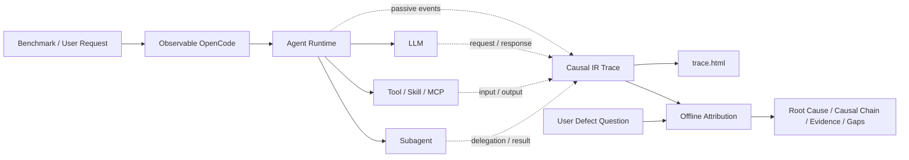

# Observable OpenCode

面向 AI Harness 评测、诊断和持续优化的可观测 OpenCode。该分支在保持
OpenCode Agent 原有执行行为的前提下，被动记录任务编排、上下文变换、LLM
请求、Tool/Skill/MCP、Subagent、代码变更、验证结果和最终回复之间的语义数据流，
并提供独立的离线因果归因模块。

> 本项目基于开源 [OpenCode](https://github.com/anomalyco/opencode) 改造，
> 不是 OpenCode 官方发行版，也不隶属于 OpenCode 团队。

## 核心能力

- **可评估**：可以用 benchmark case、评审事实和外部 evaluation 结果描述最终表现。
- **可观测**：每个 case 生成一份结构化 Trace，并用 `trace.html` 展示完整 Agent 流程和组件数据流。
- **可归因**：基于 Causal IR、重建的数据流和 LLM 判断执行后向语义污点分析。
- **可优化**：把根因、因果链、证据引用和语义缺口转化为 Harness 的下一轮优化输入。
- **行为隔离**：Trace 插装只被动记录；归因模块离线运行，不把分析结果反馈给正在执行的 Agent。



## 获取 Release 可执行文件

GitHub Actions 会发布 Linux 与 macOS 的独立可执行文件，不需要在目标机器上
执行 `bun install`。从 [Releases](https://github.com/zyscoder/observable-opencode/releases)
选择对应资产：

| 系统 | 推荐资产 |
| --- | --- |
| Linux x86_64 | `opencode-observable-linux-x64` |
| 旧 x86_64 CPU（无 AVX2） | `opencode-observable-linux-x64-baseline` |
| Alpine/musl x86_64 | `opencode-observable-linux-x64-musl` |
| Linux arm64 | `opencode-observable-linux-arm64` |
| macOS Apple Silicon | `opencode-observable-darwin-arm64` |
| macOS Intel | `opencode-observable-darwin-x64` |

以 Linux x86_64 为例：

```bash
RELEASE_TAG="<Releases 页面中的版本，例如 v1.2.3-observable.1>"
ASSET="opencode-observable-linux-x64"
BASE_URL="https://github.com/zyscoder/observable-opencode/releases/download/${RELEASE_TAG}"

curl -fL -o "$ASSET" "$BASE_URL/$ASSET"
curl -fL -o SHA256SUMS "$BASE_URL/SHA256SUMS"
grep "  $ASSET$" SHA256SUMS | sha256sum --check
chmod +x "$ASSET"
./"$ASSET" --version
```

替换现有 `opencode` 前建议先备份：

```bash
CURRENT_OPENCODE="$(command -v opencode || true)"
if [ -n "$CURRENT_OPENCODE" ]; then
  cp "$CURRENT_OPENCODE" "${CURRENT_OPENCODE}.backup.$(date +%Y%m%d%H%M%S)"
fi
sudo install -m 755 opencode-observable-linux-x64 /usr/local/bin/opencode
opencode --version
```

macOS 校验可执行：

```bash
shasum -a 256 opencode-observable-darwin-arm64
chmod +x opencode-observable-darwin-arm64
./opencode-observable-darwin-arm64 --version
```

如果 macOS 阻止运行从浏览器下载的二进制，可在确认校验和及来源后移除隔离属性：

```bash
xattr -d com.apple.quarantine opencode-observable-darwin-arm64
```

## 配置模型与 Provider

Observable OpenCode 不引入专属运行时 Provider，也不读取某个供应商专用 API Key。
模型、认证和 Provider 均由 **OpenCode 原生配置链** 决定；本项目只被动记录已经发生的
执行。请以 OpenCode 实际加载的配置和原生 CLI、请求级覆盖为权威，不应依赖本文推断
配置合并或优先级。

OpenCode 会使用全局配置目录（通常为 `~/.config/opencode/`）中的 `config.json`、
`opencode.json` 或 `opencode.jsonc`，并发现项目中的 `opencode.json`、`opencode.jsonc`
以及 `.opencode/opencode.json`、`.opencode/opencode.jsonc`。也可使用原生入口
`OPENCODE_CONFIG`、`OPENCODE_CONFIG_DIR`、`OPENCODE_CONFIG_CONTENT`，或原生 CLI 和
请求参数覆盖。不同版本及配置来源会按 OpenCode 的原生合并规则处理。

下面是一个兼容 OpenAI 风格 API 的通用模板。可放在项目 `opencode.json` 或你选择的
原生配置文件中：

```json
{
  "$schema": "https://opencode.ai/config.json",
  "model": "{env:MODEL}",
  "provider": {
    "compatible": {
      "npm": "@ai-sdk/openai-compatible",
      "name": "OpenAI Compatible",
      "options": {
        "baseURL": "{env:URL}",
        "apiKey": "{env:APIKEY}"
      },
      "models": {
        "glm-4.5": { "name": "GLM 4.5" },
        "deepseek-v4-flash": { "name": "DeepSeek V4 Flash" }
      }
    }
  }
}
```

其中 `MODEL` 必须是完整模型标识，例如 `compatible/glm-4.5`；`APIKEY` 和 `URL`
分别提供该兼容服务的认证和地址。它们只是此模板选用的环境变量占位符，可以替换为
企业自己的变量名，并不是 Observable OpenCode 的特殊运行时环境变量。若使用 OpenCode
内置 Provider，应优先使用该 Provider 的原生认证和配置方式。

企业网络无法稳定访问 `models.dev` 时，可关闭启动阶段的远程模型目录刷新。程序会使用
编译进可执行文件的模型快照：

```bash
export OPENCODE_DISABLE_MODELS_FETCH=1
```

也可以按 OpenCode 原生方式限制刷新超时或指向企业内部镜像：

```bash
export OPENCODE_MODELS_FETCH_TIMEOUT_MS=2500
# export OPENCODE_MODELS_URL="https://models.example.internal"
```

## 交互式 TUI 并记录 Trace

交互式 TUI 是一等入口。先通过上述 OpenCode 原生配置选择 Provider 和模型，再启动
目标项目：

```bash
export MODEL="compatible/glm-4.5"
export APIKEY="<your-compatible-api-key>"
export URL="https://api.example.com/v1"

export OPENCODE_DISABLE_MODELS_FETCH=1
export OPENCODE_CASE_TRACE=1
export OPENCODE_CASE_TRACE_DIR="/data/evo-bench/traces"
# 可选：为一次 benchmark case 指定稳定名称
export OPENCODE_CASE_ID="benchmark-case-001"

opencode /data/repos/target-project
```

同一 root session 的多轮交互写入同一份 Trace。输入 `/new` 会独立完成旧 root，并为
新 root 创建另一份 Trace；Subagent 的事件归入其父 root。正常退出、root session 删除
或收到可捕获的 `SIGINT`、`SIGTERM`、`SIGHUP` 时，程序会先持久化已有数据，再对每个
已完成 root 向 `stderr` 输出保存位置：

```text
[observable-opencode] Session trace saved
  session: ses_...
  case: benchmark-case-001
  status: cancelled
  directory: /data/evo-bench/traces/benchmark-case-001--ses_...--a1b2c3d4
  html: /data/evo-bench/traces/benchmark-case-001--ses_...--a1b2c3d4/trace.html
  json: /data/evo-bench/traces/benchmark-case-001--ses_...--a1b2c3d4/trace.json
  partial: /data/evo-bench/traces/benchmark-case-001--ses_...--a1b2c3d4/partial/latest.json
```

可捕获的中断会保留有效 Trace，状态通常为 `cancelled`；仅有阶段性快照时为 `partial`。
`SIGKILL` 无法执行任何用户态退出处理，只能依赖进程运行期间已经原子写入的
`partial/latest.json`。设置 `OPENCODE_CASE_TRACE_QUIET=1` 只关闭终端路径提示，
不会关闭 Trace。

## 启动 HTTP Server 并记录 Trace

Benchmark 可以通过 `opencode session <-> HTTP server <-> request` 执行，以贴近
Harness 的实际交互行为。HTTP 路径与 TUI 使用同一套原生配置；请求中不需要重复指定
模型。

```bash
export OPENCODE_SERVER_PASSWORD="<server-password>"
export OPENCODE_CASE_TRACE=1
export OPENCODE_CASE_TRACE_DIR="/data/evo-bench/traces"
export OPENCODE_CASE_ID="benchmark-case-001"

opencode serve --hostname 127.0.0.1 --port 4096
```

在另一个终端创建 session 并发送消息：

```bash
PROJECT_DIR="/data/repos/target-project"
AUTH="$(printf 'opencode:%s' "$OPENCODE_SERVER_PASSWORD" | base64)"

SESSION_JSON="$(curl -fsS -X POST http://127.0.0.1:4096/session \
  -H "Authorization: Basic $AUTH" \
  -H "x-opencode-directory: $PROJECT_DIR" \
  -H 'content-type: application/json' \
  --data '{}')"
SESSION_ID="$(printf '%s' "$SESSION_JSON" | jq -er '.id')"

curl -fsS -X POST "http://127.0.0.1:4096/session/$SESSION_ID/message" \
  -H "Authorization: Basic $AUTH" \
  -H "x-opencode-directory: $PROJECT_DIR" \
  -H 'content-type: application/json' \
  --data '{
    "parts": [{"type": "text", "text": "分析并修复当前项目中的测试失败。"}]
  }'
```

只有特定 case 需要与项目或全局配置不同的模型时，才使用 OpenCode 原生请求级 model
覆盖。完成一个 HTTP session 时建议显式删除它，以立刻完成该 root 的 Trace；否则服务
关闭时会统一收尾：

```bash
curl -fsS -X DELETE "http://127.0.0.1:4096/session/$SESSION_ID" \
  -H "Authorization: Basic $AUTH" \
  -H "x-opencode-directory: $PROJECT_DIR"
```

## Trace 目录

一个进程可以生成多份 root Trace，而不是只有一份全局 Trace。以 case ID
`benchmark-case-001` 为例，首个 root 使用基础目录，后续 root 和进程级事件使用各自
独立目录：

```text
/data/evo-bench/traces/
├── benchmark-case-001/                              # first root
├── benchmark-case-001--<session>--<digest>/          # later root
└── benchmark-case-001--process--<digest>/             # process-level events
```

每个目录都保持相同的产物结构：

```text
<trace-directory>/
├── trace.html                 # 可视化入口
├── trace.json                 # Causal IR 语义 Trace
├── provenance-trace.json      # 归因事实投影
├── legacy-trace.json          # 兼容投影
├── events.jsonl               # 结构化事件流
├── raw-events.jsonl           # 原始事件流
├── manifest.json              # root/process 与产物清单
├── artifacts/                 # 大文本和可校验语义载荷
└── partial/
    └── latest.json            # 运行中/异常退出恢复快照
```

直接在浏览器中打开所需 root 的 `trace.html`，即可查看主 Agent、Subagent、任务编排、
上下文压缩、message 多层转换、LLM、Tool/Skill/MCP、文件变更、验证和最终回复之间的
完整数据流。大文本保存在 `artifacts/` 中，在 HTML 内按需展开。

## 使用离线归因 CLI

归因模块目前随源码仓库发布，并未安装为系统级命令。它不要求当前目录位于
`observable-opencode`；只需要把仓库中的 Python 包绝对路径加入 `PYTHONPATH`。
下面的 DeepSeek/Anthropic 兼容配置仅用于可选的离线归因 Judge，和 OpenCode 运行时的
Provider、模型选择及认证完全无关。

```bash
export OBSERVABLE_OPENCODE_HOME="/opt/observable-opencode"
python3 -m pip install anthropic

export ANTHROPIC_API_KEY="<your-deepseek-api-key>"
export ANTHROPIC_BASE_URL="https://api.deepseek.com/anthropic"
export CLAUDE_MODEL="deepseek-v4-flash"

PYTHONPATH="$OBSERVABLE_OPENCODE_HOME/tools/trace_attribution" \
python3 -m trace_attribution \
  --engine recursive-agentic \
  --trace /data/evo-bench/traces/benchmark-case-001/trace.json \
  --question "为什么本次修改编译失败？" \
  --out /data/evo-bench/attribution/benchmark-case-001.json
```

`--question` 用于描述用户真正想定位的缺陷，例如：

- `为什么问题回答错误？`
- `为什么编译失败？`
- `为什么最终回复没有给出正确的配置项？`
- `为什么 Agent 计划调用 Subagent，但实际没有执行？`

它与兼容参数 `--objective` 互斥。推荐使用 `recursive-agentic` 引擎执行
“候选检索、递归后向污点、多假设回溯、独立根因确认”的融合流程。

归因 JSON 在普通报告之外增加：

- `analysis_question`：规范化问题、稳定问题 ID 和 Trace 绑定；
- `conclusion`：已确认根因，或明确的证据不足结论；
- `causal_chain`：从表现缺陷回溯到引入节点的语义路径；
- `supporting_evidence_refs`：可审计的 Trace 证据引用；
- `rejected_hypotheses`：被排除的候选及原因；
- `confidence`：已确认根因的置信度；
- `unresolved_gaps`：Trace 缺失或仍无法判定的语义信息。

如果没有足够证据，模块会返回
`no_confirmed_root_cause / evidence_insufficient`，不会为了给出答案而虚构根因。

## Python API

```python
from pathlib import Path

from trace_attribution import AttributionOptions, AttributionRequest, analyze

result = analyze(
    AttributionRequest(
        trace_path=Path("/data/evo-bench/traces/benchmark-case-001/trace.json"),
        output_path=Path("/data/evo-bench/attribution/benchmark-case-001.json"),
        question="为什么本次修改编译失败？",
        options=AttributionOptions(
            engine="recursive-agentic",
            model="deepseek-v4-flash",
            base_url="https://api.deepseek.com/anthropic",
        ),
    )
)

print(result.payload["conclusion"])
print(result.payload["causal_chain"])
print(result.payload["supporting_evidence_refs"])
```

运行该程序时同样设置：

```bash
PYTHONPATH=/opt/observable-opencode/tools/trace_attribution python3 analyze.py
```

详细的归因算法、预算、checkpoint、benchmark bundle 和报告字段说明见
[tools/trace_attribution/README.md](tools/trace_attribution/README.md)。

## 从源码运行与验证

源码构建需要 Bun；GitHub Release 二进制的目标机器不需要 Bun。

```bash
bun install
bun --cwd packages/opencode run typecheck
bun --cwd packages/opencode test \
  test/observability/trace-publication.test.ts \
  test/observability/case-trace.test.ts

PYTHONPATH=tools/trace_attribution \
python3 -m unittest discover -s tools/trace_attribution/tests
```

---

## 上游 OpenCode 说明

<p align="center">
  <a href="https://opencode.ai">
    <picture>
      <source srcset="packages/console/app/src/asset/logo-ornate-dark.svg" media="(prefers-color-scheme: dark)">
      <source srcset="packages/console/app/src/asset/logo-ornate-light.svg" media="(prefers-color-scheme: light)">
      
    </picture>
  </a>
</p>
<p align="center">The open source AI coding agent.</p>
<p align="center">
  <a href="https://opencode.ai/discord"></a>
  <a href="https://www.npmjs.com/package/opencode-ai"></a>
  <a href="https://github.com/anomalyco/opencode/actions/workflows/publish.yml"></a>
</p>

<p align="center">
  <a href="README.md">English</a> |
  <a href="README.zh.md">简体中文</a> |
  <a href="README.zht.md">繁體中文</a> |
  <a href="README.ko.md">한국어</a> |
  <a href="README.de.md">Deutsch</a> |
  <a href="README.es.md">Español</a> |
  <a href="README.fr.md">Français</a> |
  <a href="README.it.md">Italiano</a> |
  <a href="README.da.md">Dansk</a> |
  <a href="README.ja.md">日本語</a> |
  <a href="README.pl.md">Polski</a> |
  <a href="README.ru.md">Русский</a> |
  <a href="README.bs.md">Bosanski</a> |
  <a href="README.ar.md">العربية</a> |
  <a href="README.no.md">Norsk</a> |
  <a href="README.br.md">Português (Brasil)</a> |
  <a href="README.th.md">ไทย</a> |
  <a href="README.tr.md">Türkçe</a> |
  <a href="README.uk.md">Українська</a> |
  <a href="README.bn.md">বাংলা</a> |
  <a href="README.gr.md">Ελληνικά</a> |
  <a href="README.vi.md">Tiếng Việt</a>
</p>

[](https://opencode.ai)

---

### Installation

```bash
# YOLO
curl -fsSL https://opencode.ai/install | bash

# Package managers
npm i -g opencode-ai@latest        # or bun/pnpm/yarn
scoop install opencode             # Windows
choco install opencode             # Windows
brew install anomalyco/tap/opencode # macOS and Linux (recommended, always up to date)
brew install opencode              # macOS and Linux (official brew formula, updated less)
sudo pacman -S opencode            # Arch Linux (Stable)
paru -S opencode-bin               # Arch Linux (Latest from AUR)
mise use -g opencode               # Any OS
nix run nixpkgs#opencode           # or github:anomalyco/opencode for latest dev branch
```

> [!TIP]
> Remove versions older than 0.1.x before installing.

### Desktop App (BETA)

OpenCode is also available as a desktop application. Download directly from the [releases page](https://github.com/anomalyco/opencode/releases) or [opencode.ai/download](https://opencode.ai/download).

| Platform              | Download                           |
| --------------------- | ---------------------------------- |
| macOS (Apple Silicon) | `opencode-desktop-mac-arm64.dmg`   |
| macOS (Intel)         | `opencode-desktop-mac-x64.dmg`     |
| Windows               | `opencode-desktop-windows-x64.exe` |
| Linux                 | `.deb`, `.rpm`, or `.AppImage`     |

```bash
# macOS (Homebrew)
brew install --cask opencode-desktop
# Windows (Scoop)
scoop bucket add extras; scoop install extras/opencode-desktop
```

#### Installation Directory

The install script respects the following priority order for the installation path:

1. `$OPENCODE_INSTALL_DIR` - Custom installation directory
2. `$XDG_BIN_DIR` - XDG Base Directory Specification compliant path
3. `$HOME/bin` - Standard user binary directory (if it exists or can be created)
4. `$HOME/.opencode/bin` - Default fallback

```bash
# Examples
OPENCODE_INSTALL_DIR=/usr/local/bin curl -fsSL https://opencode.ai/install | bash
XDG_BIN_DIR=$HOME/.local/bin curl -fsSL https://opencode.ai/install | bash
```

### Agents

OpenCode includes two built-in agents you can switch between with the `Tab` key.

- **build** - Default, full-access agent for development work
- **plan** - Read-only agent for analysis and code exploration
  - Denies file edits by default
  - Asks permission before running bash commands
  - Ideal for exploring unfamiliar codebases or planning changes

Also included is a **general** subagent for complex searches and multistep tasks.
This is used internally and can be invoked using `@general` in messages.

Learn more about [agents](https://opencode.ai/docs/agents).

### Documentation

For more info on how to configure OpenCode, [**head over to our docs**](https://opencode.ai/docs).

### Contributing

If you're interested in contributing to OpenCode, please read our [contributing docs](./CONTRIBUTING.md) before submitting a pull request.

### Building on OpenCode

If you are working on a project that's related to OpenCode and is using "opencode" as part of its name, for example "opencode-dashboard" or "opencode-mobile", please add a note to your README to clarify that it is not built by the OpenCode team and is not affiliated with us in any way.

### FAQ

#### How is this different from Claude Code?

It's very similar to Claude Code in terms of capability. Here are the key differences:

- 100% open source
- Not coupled to any provider. Although we recommend the models we provide through [OpenCode Zen](https://opencode.ai/zen), OpenCode can be used with Claude, OpenAI, Google, or even local models. As models evolve, the gaps between them will close and pricing will drop, so being provider-agnostic is important.
- Built-in opt-in LSP support
- A focus on TUI. OpenCode is built by neovim users and the creators of [terminal.shop](https://terminal.shop); we are going to push the limits of what's possible in the terminal.
- A client/server architecture. This, for example, can allow OpenCode to run on your computer while you drive it remotely from a mobile app, meaning that the TUI frontend is just one of the possible clients.

---

**Join our community** [Discord](https://discord.gg/opencode) | [X.com](https://x.com/opencode)
